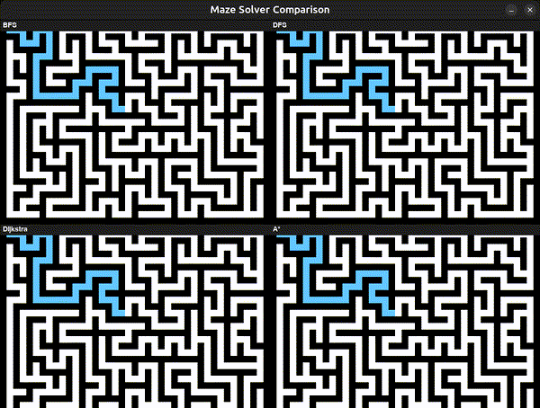
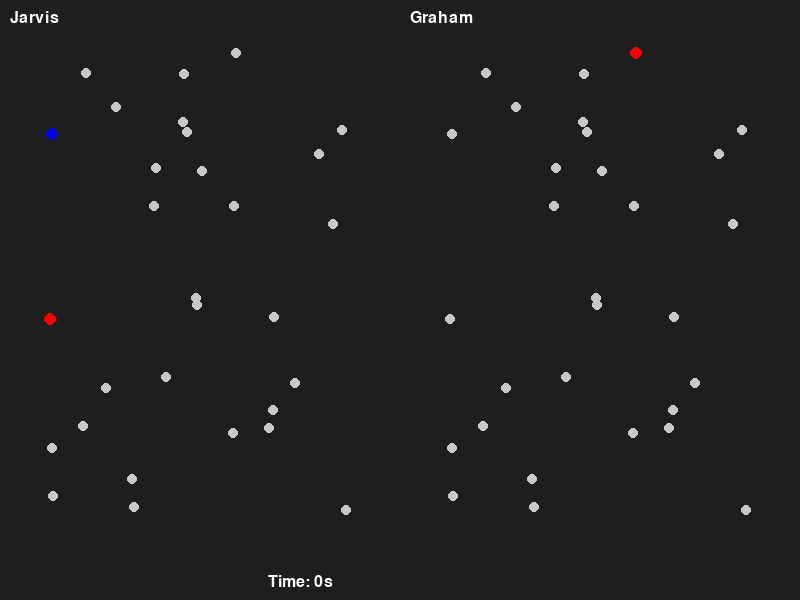
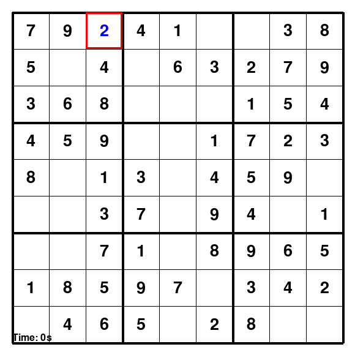
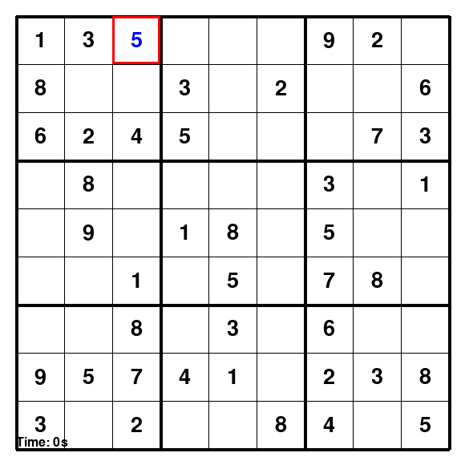

# AlgoViz: Algorithm Visualization Toolkit

**AlgoViz** is a Python project that provides interactive, real-time visualizations for core algorithms in computer science, currently featuring:

1. **Maze Solver Visualizer**: Generates random perfect mazes and solves them side by side with four classic graph-search algorithms.
2. **Convex Hull Visualizer**: Builds and animates the convex hull of a random 2D point cloud using Jarvis’s March and Graham Scan.
3. **Sudoku Solver Visualizer**: Generates and solves Sudoku puzzles of varying difficulty (Easy & Medium) via backtracking, with real-time grid updates and GIF export.

---

## 🔍 Features

| Visualizer        | Algorithms                                  | Layout                 |
| ----------------- | ------------------------------------------- | ---------------------- |
| **Maze Solver**   | BFS, DFS, Dijkstra, A\*                     | 2×2 quadrant view      |
| **Convex Hull**   | Jarvis’s March (Gift Wrapping), Graham Scan | 1×2 side-by-side panes |
| **Sudoku Solver** | Backtracking (Easy & Medium puzzles)        | 9×9 grid animation     |

* **Real-time Animation**: Watch each algorithm’s internal steps—visits, comparisons, placements—come alive on screen.
* **Frame Control**: Auto-play, manual stepping (←/→), and reset (press **R**).
* **GIF Export**: Scripts capture frames and automatically save animated GIFs for later sharing.
* **Benchmarking (Maze)**: Collect timing, node counts, and path lengths with Matplotlib plots.

---

## ⚙️ Requirements

* Python 3.9+
* [NumPy](https://numpy.org/)
* [Pygame](https://www.pygame.org/)
* [ImageIO](https://imageio.github.io/) & [NumPy](https://numpy.org/) (for GIF export)
* [Matplotlib](https://matplotlib.org/) (for maze benchmarking)

Install all dependencies:

```bash
pip install -r requirements.txt
```

---

## 🚀 Getting Started

1. **Clone the repository**

```bash
git clone https://github.com/SanketRt/AlgoViz.git
cd AlgoViz
```


2. **Create & activate a virtual environment**  
```bash
python3 -m venv .venv
source .venv/bin/activate    # Windows: .venv\Scripts\Activate.ps1
pip install -r requirements.txt
````

### 🏃 Maze Solver Visualizer

Launch the maze solver:

```bash
python3 visualize.py
```

You’ll see a window divided into four quadrants showing BFS, DFS, Dijkstra, and A\* exploring and solving the same random maze.

### 🏖 Convex Hull Visualizer

Animate convex hull construction:

```bash
python3 visualize_ch.py
```

* Left pane: **Jarvis’s March**
* Right pane: **Graham Scan**
* Auto-advances until both hulls complete, displays elapsed time, and saves `convex_hull_animation.gif`.

### 🧩 Sudoku Solver Visualizer

Generate and solve Sudoku puzzles via backtracking:

* **Easy Mode** (25 blanks):

```bash
python3 visualize_sudoku_easy.py
```

  Saves `sudoku_solver_easy.gif`.

* **Medium Mode** (40 blanks):

```bash
python3 visualize_sudoku_med.py
```

  Saves `sudoku_solver_med.gif`.

---









---

## 🔄 Generating GIF Previews

* **Maze Solver**: Use a screen capture tool (e.g. LICEcap or `ffmpeg`) to record your run and place the GIF in `assets/`.
* **Convex Hull & Sudoku**: GIFs are saved automatically by their scripts.


